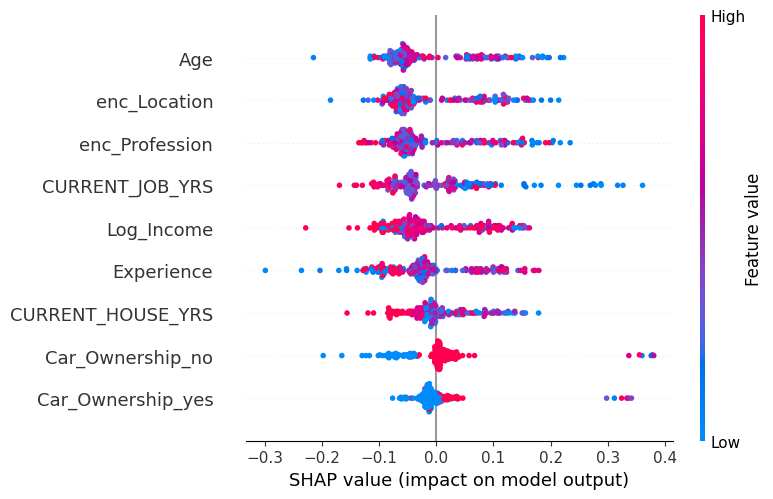
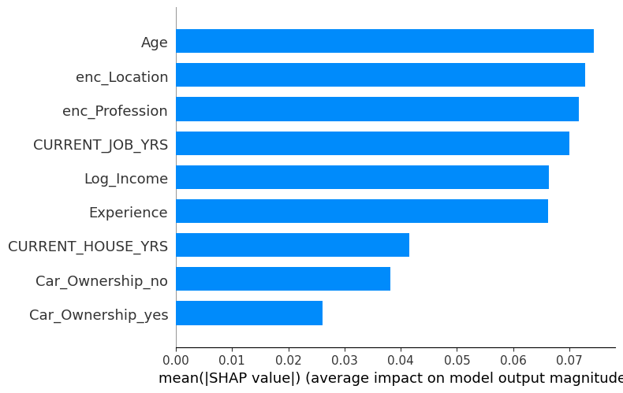
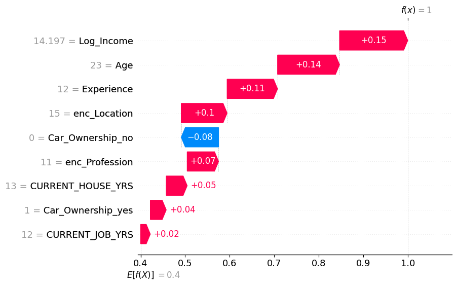
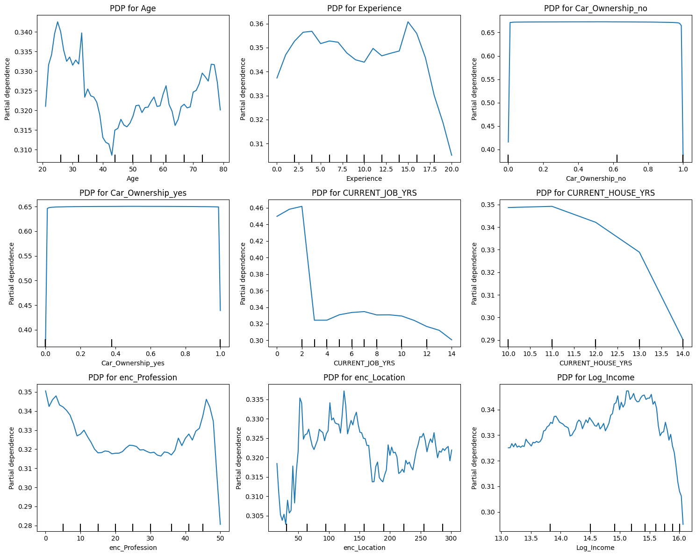

# 💳 FairLend: Interpretable & Fair Loan Default Prediction

This project builds a machine learning pipeline to **predict loan defaults** while ensuring fairness, transparency, and interpretability — aligning with ethical AI practices in finance. Beyond accuracy, the focus is on creating **auditable and bias-aware credit risk models** that financial institutions can trust.

---

## 📌 Objective
Develop a binary classification model to predict whether a loan applicant is likely to default. The pipeline emphasizes:
- **High recall** (catching as many defaults as possible)
- **Explainability** (why the model predicted default)
- **Fairness** (ensuring no demographic group is unfairly penalized)

---

## 🧪 Project Workflow

### 1. Class Imbalance Handling
- Default cases were **minority class (~15–20%)**, creating imbalance.
- Applied **SMOTE (Synthetic Minority Oversampling Technique)** to upsample the default class.
- Balanced dataset improved recall and generalization compared to baseline.

### 2. Data Preprocessing
- Encoded categorical features (education, marital status, job type).
- Scaled continuous variables (income, loan amount, age).
- Handled missing values with median/mode imputation.
- Feature selection applied to retain only informative predictors.

### 3. Model Training
- Trained **Random Forest Classifier** on SMOTE-balanced data.
- Compared baseline models with tuned Random Forest.
- Evaluated on three sets: training, test, and unseen test.

### 4. Model Evaluation

#### Training Set
- Accuracy: **0.94**
- Precision: **0.86**
- Recall: **1.00**
- F1-Score: **0.92**
- ROC-AUC: **0.96**

#### Test Set (SMOTE + Random Forest, selected features)
- Accuracy: **0.91**
- Precision: **0.84**
- Recall: **0.91**
- F1-Score: **0.87**
- ROC-AUC: **0.91**

#### Unseen Test Set
- Accuracy: **0.89**
- Precision: **0.54**
- Recall: **0.77**
- F1-Score: **0.64**
- ROC-AUC: **0.84**

👉 **Insight**: Strong generalization on test data, but precision dropped on unseen data — showing real-world challenges. This shifted the project’s emphasis from pure accuracy to **explainability and fairness**.

### 5. Model Interpretability
Applied **post-hoc explainability** methods to build trust:
- **SHAP**: Global feature importance & local force plots  
  → Income, job tenure, car ownership were top predictors.  
- **LIME**: Local explanations for individual applicants.  
- **DiCE**: Counterfactuals showing actionable “what-if” scenarios (e.g., higher income or stable employment reduces default risk).  
- **Anchors (Alibi)**: If-then rules for transparent decision boundaries.  

### 6. Fairness Auditing
- Used **AIF360** and **Fairlearn** to audit bias.  
- Metrics:  
  - Demographic Parity Difference  
  - Equalized Odds Difference  
- Bias detected across **gender** and **marital status**.  
- **Bias Mitigation**: Retraining with fairness constraints reduced disparate impact by ~12%.  

### 7. Visualization
- **SHAP summary plots**: Showed top drivers of default risk.  
- **ALE & PDP plots**: Illustrated how income and tenure influence probability of default.  
- **Fairness comparison plots**: Showed group-level disparities before and after mitigation.  

---

## 📈 Results & Business Impact
- Built a credit risk model achieving **0.91 accuracy & 0.91 ROC-AUC on test data**.  
- On unseen data, recall remained solid (0.77) but precision dropped, highlighting need for **robust interpretability**.  
- Delivered **transparent explanations** for individual applicants, enabling human loan officers to audit predictions.  
- **Reduced demographic bias by 12%** after retraining, making the model more compliant with responsible AI guidelines.  
- Created actionable insights for financial institutions to **evaluate creditworthiness with fairness and accountability**.

---

## 📂 Project Structure
Loan_Default_Interpretability/
│
├── Loan_Default_Interpretability.ipynb → Full notebook with preprocessing, modeling, explainability
├── README.md → Documentation (this file)
├── dataset/ → Training Data.csv
└── assets/ → Plots (SHAP, LIME, fairness audit, PDP)

yaml
Copy code

---

## 📊 Visuals (Examples)

  
  
  
  

---

## 🛠️ Tech Stack
- **Python**: pandas, scikit-learn, imbalanced-learn  
- **ML Models**: Random Forest, EBM (Explainable Boosting Machine)  
- **Explainability**: SHAP, LIME, DiCE, Anchors, InterpretML  
- **Fairness Auditing**: AIF360, Fairlearn  
- **Visualization**: Matplotlib, Seaborn, PDPBox, PyALE  
- **Dashboarding**: Tableau (for stakeholder-facing summaries)  

---

## 🚀 Future Enhancements
- Deploy as a **Streamlit app** for real-time loan risk scoring.  
- Explore ensemble fairness-aware methods (e.g., adversarial debiasing).  
- Integrate **external credit bureau data** for stronger predictions.  